# Watchpost UI tour

Every screen of the web console, captured from a real run: a fresh database, **Admin → Load synthetic demo data**,
then the six-stage **attack storyline** at real speed, then a few analyst actions (an incident moved to
*investigating*, notes on the privilege-escalation alert, two scanner alerts marked false positive, a rule proposal
generated from that feedback, and a scenario evaluation). All data on screen is synthetic and labeled as such.

Desktop shots are 1280×800 at 2× pixel density, the width `DEMO_SCRIPT.md` records at. The phone shots are 390 px
wide. To regenerate them after a UI change, see [Regenerating the screenshots](#regenerating-the-screenshots).

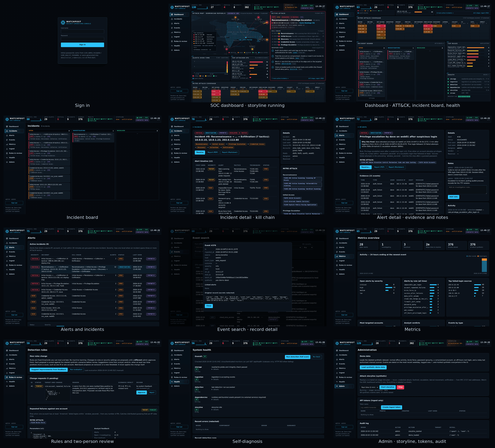

## Contents

1. [Sign in](#1-sign-in)
2. [SOC dashboard with the storyline running](#2-soc-dashboard-with-the-storyline-running)
3. [Dashboard: ATT&CK coverage, incident board, health](#3-dashboard-attck-coverage-incident-board-health)
4. [Incident board](#4-incident-board)
5. [Incident detail](#5-incident-detail)
6. [Incident report (PDF)](#6-incident-report-pdf)
7. [Alerts and active incidents](#7-alerts-and-active-incidents)
8. [Alert detail](#8-alert-detail)
9. [Event search and record detail](#9-event-search-and-record-detail)
10. [Metrics](#10-metrics)
11. [Ingest](#11-ingest)
12. [Rules and two-person review](#12-rules-and-two-person-review)
13. [Health (self-diagnosis)](#13-health-self-diagnosis)
14. [Admin](#14-admin)
15. [Read-only viewer](#15-read-only-viewer)
16. [Phone width](#16-phone-width)

## 1. Sign in

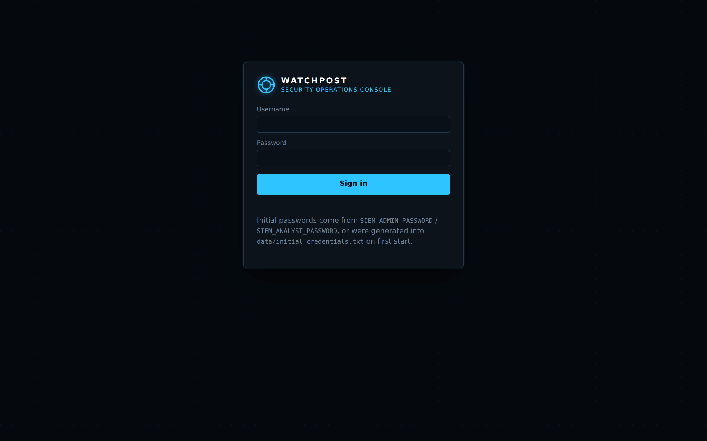

The navigation stays hidden until a session exists. The hint names where the first passwords come from; Watchpost
never prints them to the log.

## 2. SOC dashboard with the storyline running

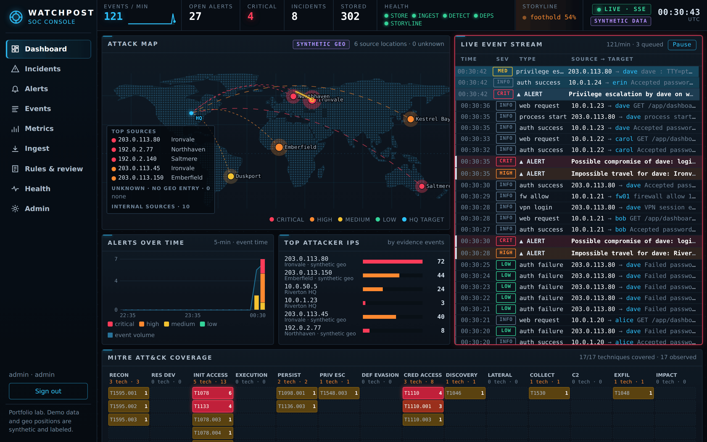

About a minute into the storyline. The status strip shows events per minute with a sparkline, open and critical
alerts, open incidents, stored events, the five health checks, and the **Storyline** tile with the current stage
and progress (`foothold 54%`). The attack map is focused on the **Dominican Republic**: the demo company's sites
are Santo Domingo (HQ), Santiago, and Punta Cana. Every attacker location is abroad, so each one enters at the edge
of the map along its true bearing from HQ, labeled with its city and distance, and a dashed arc runs to HQ. The
**SYNTHETIC GEO** chip says the positions are invented. The live event stream arrives over Server-Sent Events (`LIVE · SSE`)
and highlights alerts inline, and its panel border flashes red when a critical alert lands.

## 3. Dashboard: ATT&CK coverage, incident board, health

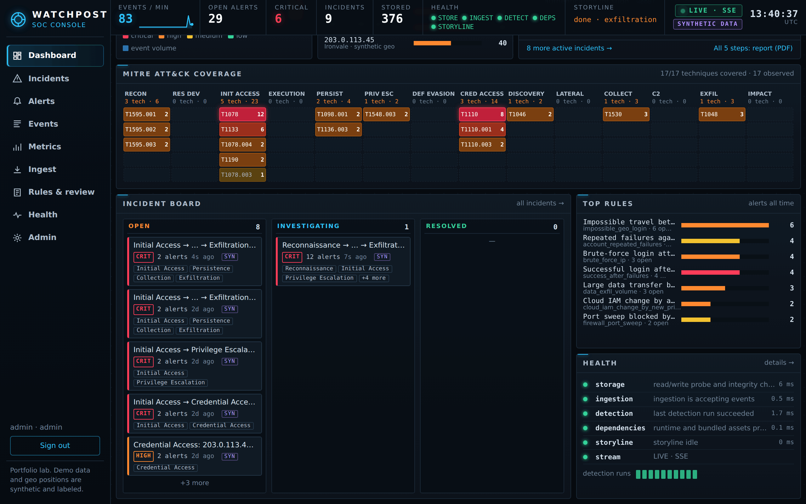

The ATT&CK heat matrix lists every technique the rules cover under its tactic, shaded and labeled by how many
alerts hit it. Below it, the incident board groups incidents by status, the top rules panel ranks rules by alert count,
and the health panel shows each check, its latency, the stream state, and the last detection runs.

## 4. Incident board

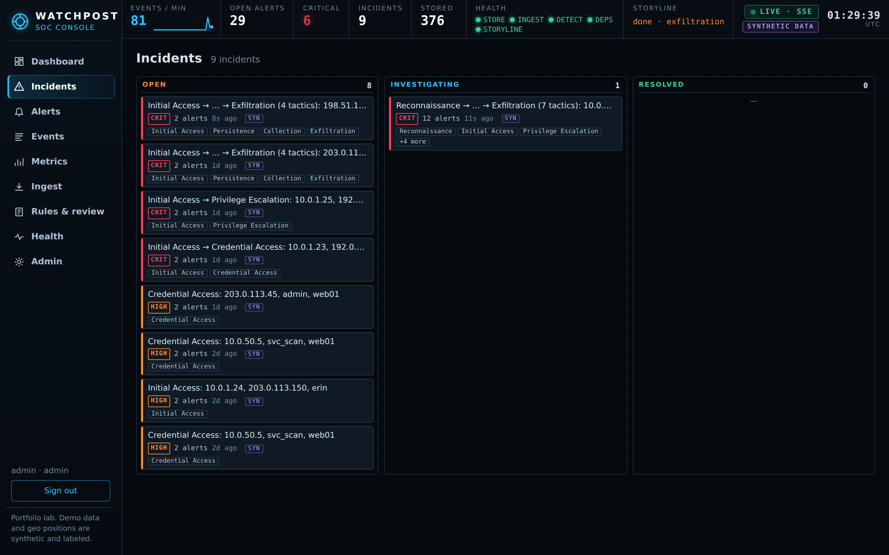

Correlated incidents as cards: severity, alert count, age, a `SYN` tag on synthetic data, and the tactics involved
(the first three, then `+N more`). The storyline's seven-tactic incident sits in *Investigating* after the analyst
picked it up.

## 5. Incident detail

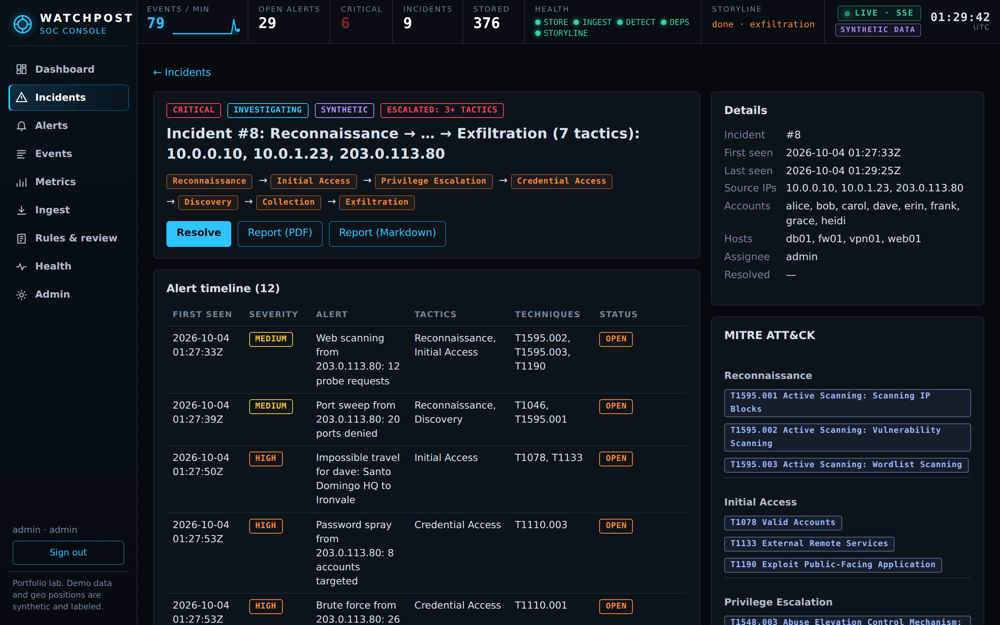

The kill chain in tactic order, the **escalated: 3+ tactics** pill, actions (resolve, Markdown and PDF reports),
the alert timeline with tactics and techniques per alert, the entities involved (IPs, accounts, hosts), and the
ATT&CK techniques grouped by tactic. The evidence table is further down the page.

## 6. Incident report (PDF)

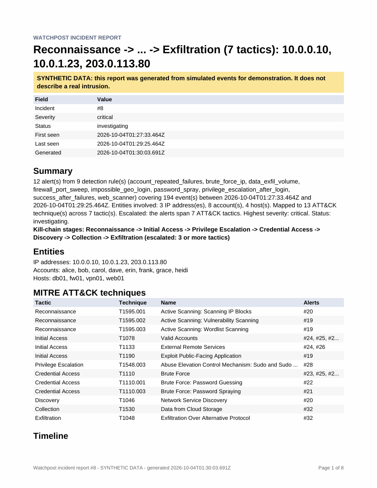

Page 1 of the generated report: the synthetic-data banner, a summary, the kill chain, entities, and the technique
table. Later pages hold the timeline, recommended actions per technique, evidence, and notes. The PDF writer is
hand-written PDF 1.4 in the standard library.

## 7. Alerts and active incidents

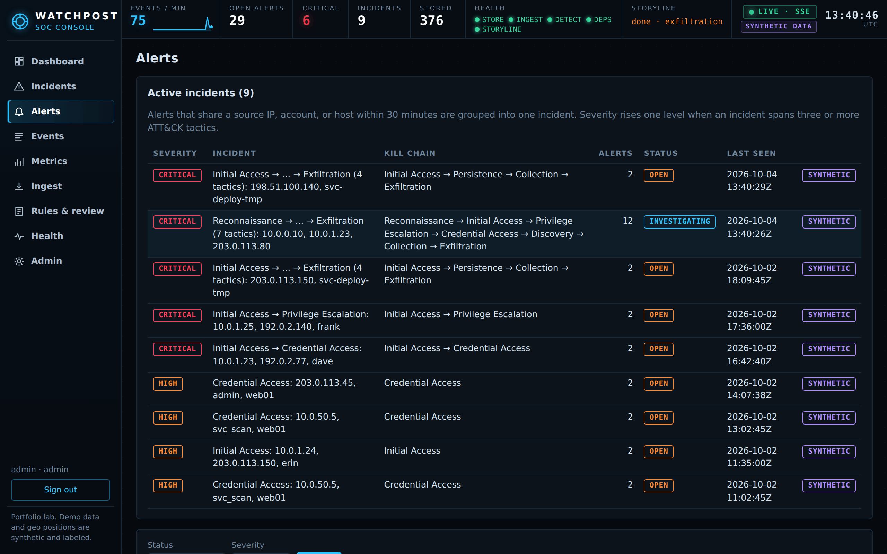

The active incidents table with the full kill chain per incident, followed by the alert queue, filtered by status and
severity, further down.

## 8. Alert detail

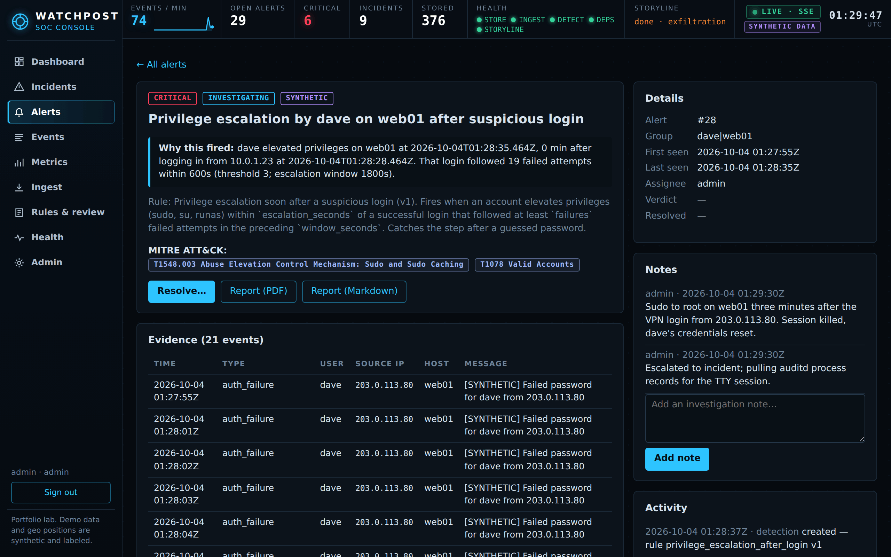

**Why this fired** in plain language with the real numbers, the rule's description and version, its ATT&CK
techniques, and the evidence events. On the right: assignee and verdict, the analyst's notes, and the activity log.
Below the evidence, a related timeline shows everything the same IPs and accounts did around the alert.

## 9. Event search and record detail

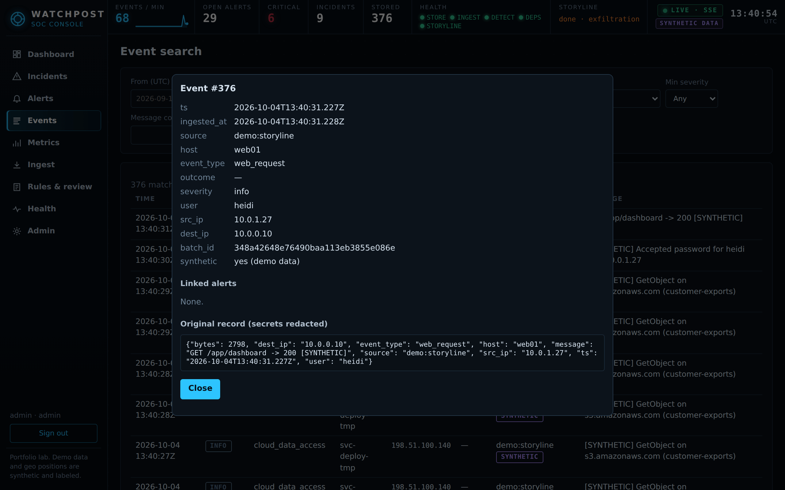

Search filters by time, type, source, severity, user, IP, host, and message text. Clicking a row opens the
normalized record, its linked alerts, and the original record with secrets redacted.

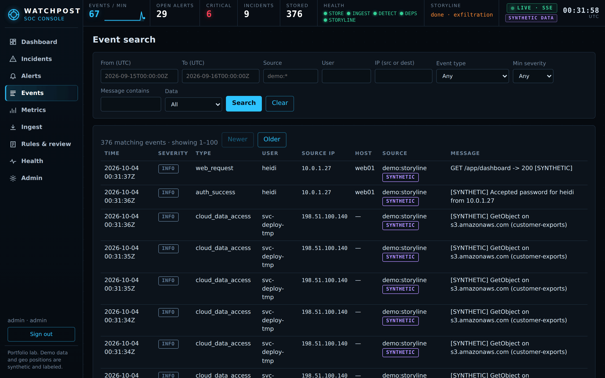

## 10. Metrics

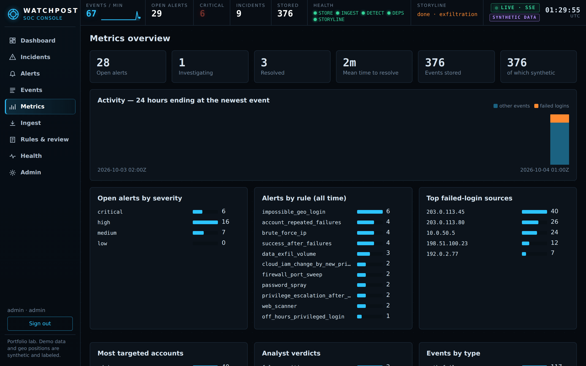

The original 1.0 dashboard: open, investigating and resolved counts, mean time to resolve, 24 hours of activity
ending at the newest event, and breakdowns by severity, rule, source IP, account, verdict, and event type. In this
run the demo dataset is dated two days before the storyline, so the 24-hour chart shows only the storyline's spike.

## 11. Ingest

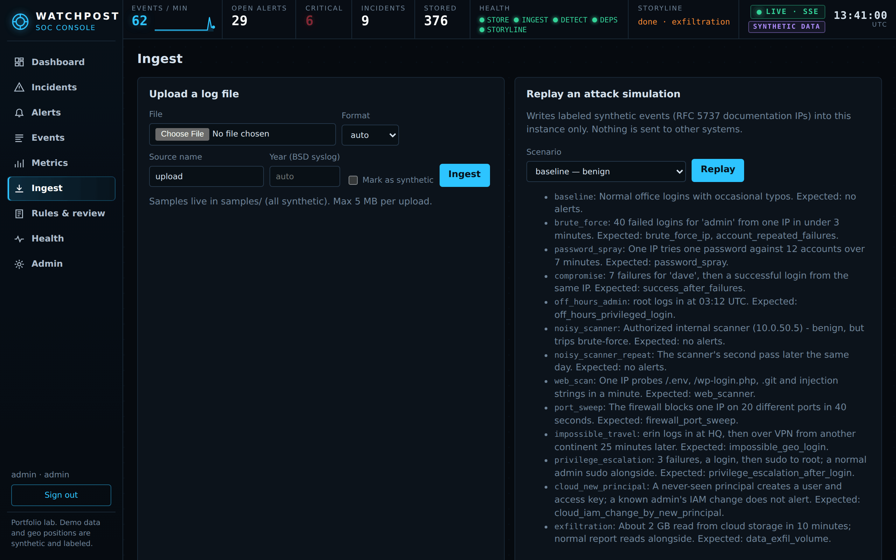

Upload a log file (auto-detected or a named format), or replay one labeled attack scenario. Each scenario lists the
rules it is expected to trigger.

## 12. Rules and two-person review

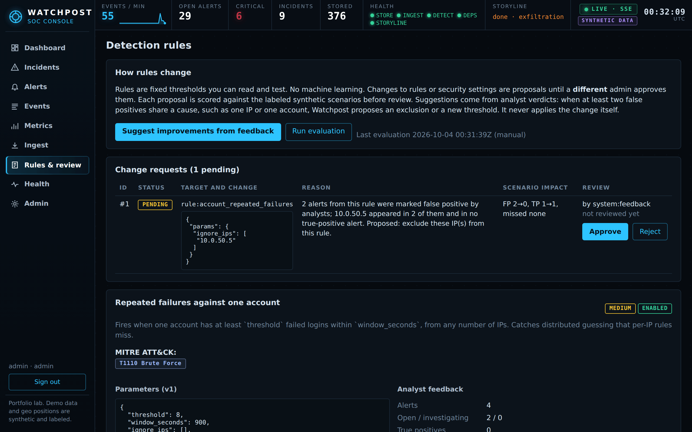

Two false-positive verdicts on the authorized scanner produced this proposal: exclude `10.0.50.5` from
`account_repeated_failures`. It was scored against the labeled scenarios (`FP 2→0, TP 1→1, missed none`) and waits
for a **different** admin to approve or reject it. Below are the rule cards with parameters, analyst-feedback
precision, and the latest scenario evaluation.

## 13. Health (self-diagnosis)

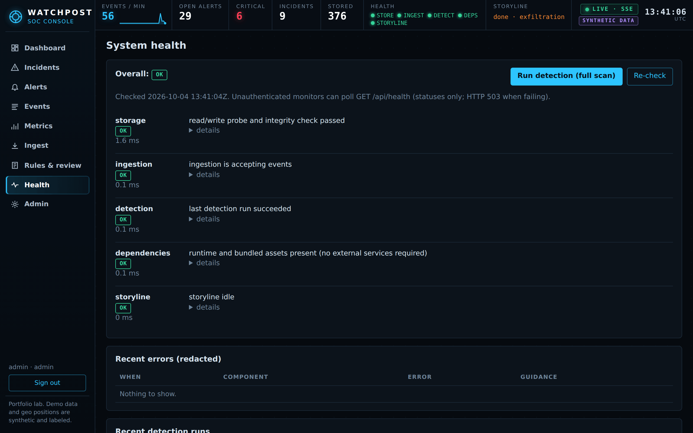

Storage, ingestion, detection, dependencies, and the storyline, each with a message, timing, and expandable
details, plus redacted recent errors and the latest detection runs.

## 14. Admin

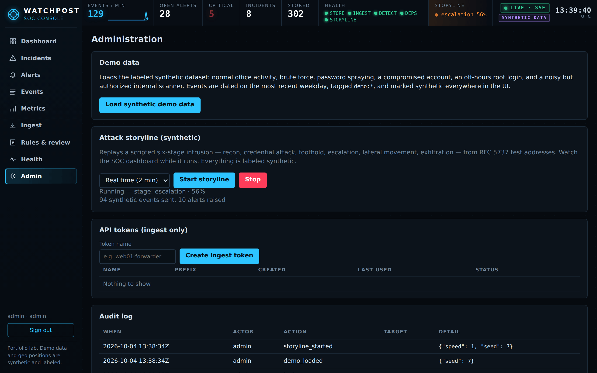

Load the demo data, start or stop the **attack storyline** (shown here running, with live progress), create
ingest-only API tokens, and read the audit log.

## 15. Read-only viewer

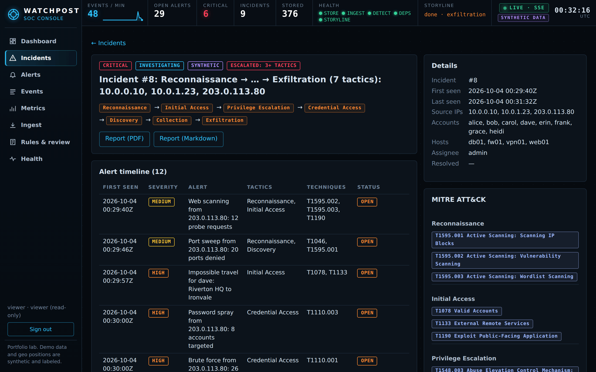

The public demo account sees the same incident without the **Resolve** button or the Admin page, and its label
reads "(read-only)". The server enforces this on every route; the UI only mirrors it.

## 16. Phone width

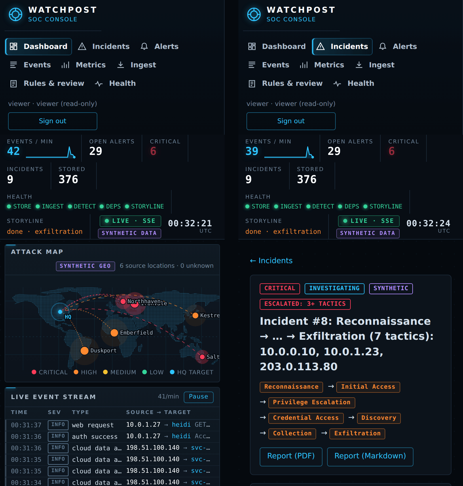

At 390 px the navigation wraps, the status strip stacks, and panels go full width. The map keeps the whole
Dominican Republic in view and drops the town and sea labels. Wide tables scroll inside their card instead of
widening the page.

## Regenerating the screenshots

`scripts/screenshots.js` drives a real browser through the run described at the top. It needs Node and Playwright,
which are not project dependencies, so install them outside the repository:

```bash
mkdir -p /tmp/shots && (cd /tmp/shots && npm i playwright && npx playwright install chromium)

# A fresh server with known passwords and rate limiting off:
SIEM_DB=/tmp/shots.db SIEM_PORT=8099 SIEM_RATE_LIMIT=0 \
  SIEM_ADMIN_PASSWORD='<admin pw>' SIEM_VIEWER_PASSWORD='<viewer pw>' ./start.sh &

WATCHPOST_ADMIN_PASSWORD='<admin pw>' WATCHPOST_VIEWER_PASSWORD='<viewer pw>' \
  NODE_PATH=/tmp/shots/node_modules node scripts/screenshots.js /tmp/shots/out   # about 3 minutes
```

The committed images are reduced to 256 colors with ImageMagick, about a third of the size with no visible loss on
this dark theme:

```bash
cd /tmp/shots/out
for f in *.png; do convert "$f" +dither -colors 256 "PNG8:docs/screenshots/$f"; done   # run paths from the repo
pdftoppm -png -r 110 -f 1 -l 1 incident-report.pdf report                              # PDF page 1
convert mobile-dashboard.png \( -size 48x1688 xc:'#05080c' \) mobile-incident.png +append +repage mobile.png
```

`soc-dashboard.png`, the README hero, is `dashboard.png` from the same run. `ui-overview.png` is an ImageMagick
`montage` of twelve desktop shots (`-tile 3x4 -geometry 800x500+18+18`).
